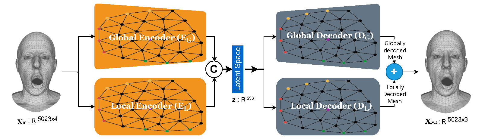
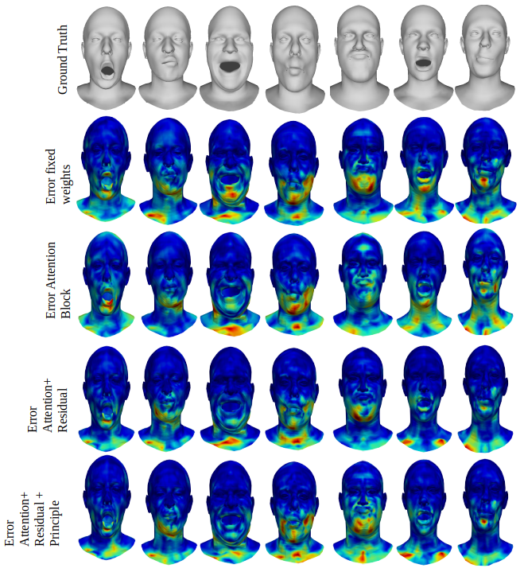
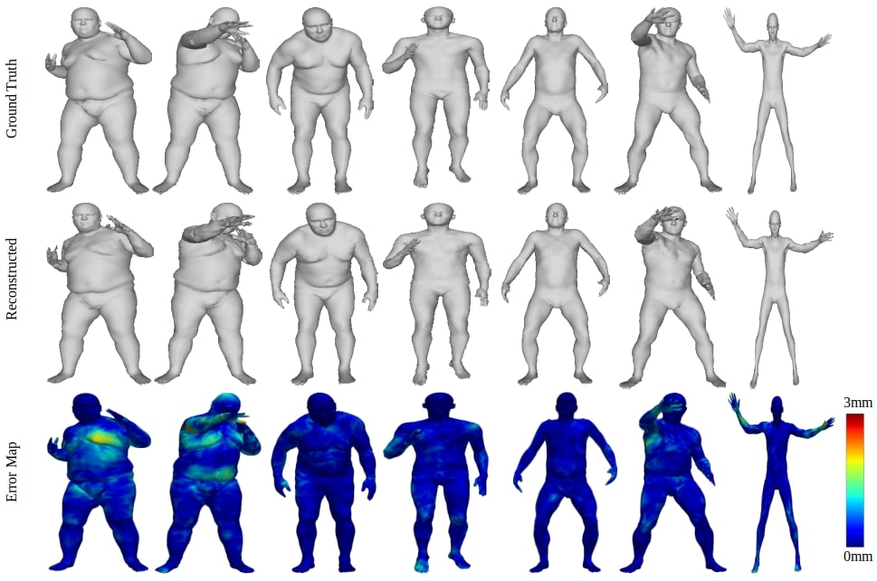
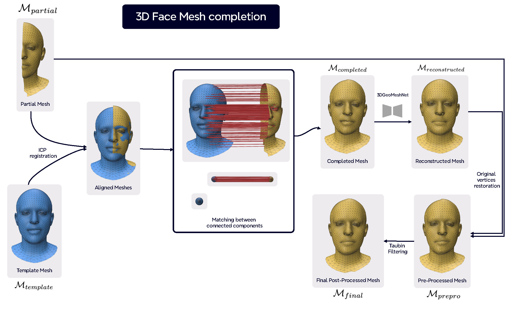
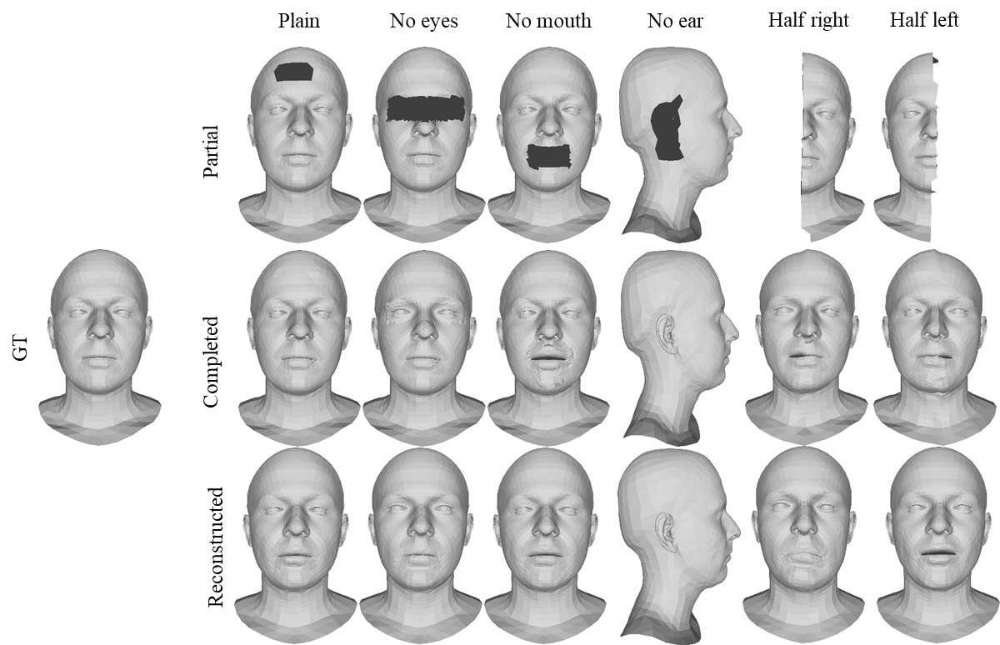

# **[3DGeoMeshNet:](https://www.sciencedirect.com/science/article/pii/S0925231226000494)** A multi-scale graph auto-encoder for 3D mesh reconstruction and completion

We propose 3D Geometric Mesh Network (3DGeoMeshNet), a method for 3D mesh reconstruction and completion. 3DGeoMeshNet is a novel Graph Convolutional Network (GCN)-based framework that leverages anisotropic
convolution layers to effectively learn multi-scale global and local features directly in the spatial domain. Unlike traditional approaches that convert meshes into voxel grids or point clouds, our method operates directly on the polygonal mesh structure, preserving geometric fidelity throughout the learning and reconstruction process. In addition to 3D mesh reconstruction, we extend our framework to tackle the 3D mesh completion task, where missing or incomplete regions of the mesh are accurately recovered. The completion results are further refined through a set of pre- and post-processing steps. We extensively evaluate our approach on two benchmark datasets, COMA and DFAUST, and achieve SOTA results for 3D mesh reconstruction on both datasets. Additionally, our mesh completion experiments on the COMA dataset demonstrate the promising capability of 3DGeoMeshNet in recovering incomplete geometries. We further showcase the versatility of our method through additional applications, including mesh denoising, interpolation, and extrapolation, highlighting the robustness and generalization ability of our framework across various 3D mesh processing tasks.:

<br>
## Overview and Results


### Proposed Model Architecture (3DGeoMeshNet)



### Mesh Reconstruction on COMA Dataset



### Mesh Reconstruction on DFAUST Dataset




<br>

## Set-up

1. Download code:

```bash
git clone https://github.com/saqibnaziir/3DGeoMeshNet.git
```

2. Create and activate a conda environment:

```bash
conda create -n 3DGeoMeshNet python=3.10
conda activate 3DGeoMeshNet
```

3. Install dependencies using `pip` or `conda` :

- [pytorch](https://pytorch.org/get-started/locally/)

  ```
  pip3 install torch torchvision torchaudio --index-url https://download.pytorch.org/whl/cu118
  ```

- [pytorch3d](https://github.com/facebookresearch/pytorch3d/blob/main/INSTALL.md)

  ```
  conda install -c fvcore -c iopath -c conda-forge fvcore iopath
  pip install "git+https://github.com/facebookresearch/pytorch3d.git@stable"
  ```
  
- [torch_geometric](https://pytorch-geometric.readthedocs.io/en/latest/install/installation.html), trimesh, [quad_mesh_simplify](https://github.com/jannessm/quadric-mesh-simplification), and [LibIGL](https://libigl.github.io/) (for principal curvature preprocessing):

  ```bash
  pip install torch_geometric trimesh quad_mesh_simplify
  ```
  For principal curvature preprocessing (`pc_run.py`), install [LibIGL](https://libigl.github.io/) (e.g. `pip install igl` or follow the official installation guide).

  For `quad_mesh_simplify`: if only the `.dist-info` appears in `site-packages`, copy the `quad_mesh_simplify` folder from the [GitHub repository](https://github.com/jannessm/quadric-mesh-simplification) into `site-packages`.

  **Note:** PyTorch3D is optional; it is not required for training (only for some evaluation/rendering utilities).

<br>

## Data

We train our model for **mesh reconstruction** on the following datasets (you must sign up and agree to their licenses to download):

- **[CoMA](https://coma.is.tue.mpg.de/)** — 3D faces with extreme expressions (ECCV 2018)
- **[DFAUST](https://dfaust.is.tue.mpg.de/)** — 4D scans of human bodies in motion (CVPR 2017)

Place your training meshes in `data/train/` and run preprocessing (see [Preprocessing: Principal Curvature](#preprocessing-principal-curvature-before-training)) before training. Pre-trained checkpoints (if released) can be placed in the `data` folder.

<br>

## Config

Copy the example config and set your paths:

```bash
cp config/config.cfg.example config/config.cfg
```

Then edit `config/config.cfg` and set the first three lines to your project path (replace `PATH_TO_PROJECT` with your clone path, e.g. `D:\COURSAI\3DGeoMeshNet` or `/path/to/3DGeoMeshNet`):

```
dataset_dir = PATH_TO_PROJECT/data
template_file = PATH_TO_PROJECT/data/template.ply
checkpoint_dir = PATH_TO_PROJECT/data
```

to match your own environment. If you create a new config file using the provided `config.cfg`, these three parameters should respectively satisfy the following conditions:

1. `dataset_dir` should contain the `norm.pt` file (if you intend to train, it should include a `train` folder instead, with all training data placed inside the `train` folder).
2. `template_file` should be the path to the template file.
3. `checkpoint_dir` should be the folder containing the model parameter files.

The provided `config.cfg` file and the corresponding `data` folder can be used normally after downloading the pre-trained model described in [Data](#data).

<br>

## Preprocessing: Principal Curvature (Before Training)

**`pc_run.py`** is a **preprocessing step** required before training when using the curvature-aware pipeline. It computes principal curvatures (k1, k2) per vertex for all training meshes using [LibIGL](https://libigl.github.io/) and saves a single file `curvature_data.pkl` in your data directory.

- **What it does:** For each mesh in the train folder, it computes principal curvature magnitudes and directions; the training dataset (`utils/my_dataset.py`) loads this pickle to validate mesh/curvature alignment and can use curvature as extra vertex features.
- **How to run:** Set `train_dir` and `curvature_save_path` in `pc_run.py` to your data path (e.g. `dataset_dir/train` and `dataset_dir/curvature_data.pkl`), then run:
  ```bash
  python pc_run.py
  ```
- **Pipeline order:** 1) Place meshes in `data/train/` → 2) Run `python pc_run.py` → 3) Run training with `python scripts/train.py --config_file config/config.cfg`.

<br>

## Train

After preparing the dataset with unified topology, you can train a shape generator using the code we provided. First, determine a dataset folder path `A`, then create or modify the config file, changing the first three lines to

```
dataset_dir = A
template_file = A\template.ply
checkpoint_dir = A
```

You may pre-select the test data that will not be used for training, and then place the remaining training data in the `train` subfolder within the folder `A`. That is to say, before training, the directory structure of folder `A` should be as follows:

```
A/
├── train/
│   ├── training_data_1.ply
│   ├── training_data_2.ply
│   └── ...
```

**Before training**, run principal curvature preprocessing so that `curvature_data.pkl` exists in folder `A` (see [Preprocessing: Principal Curvature](#preprocessing-principal-curvature-before-training)).

Then start training:

```bash
python scripts/train.py --config_file config/config.cfg
```

Optional: set an experiment name and seed:

```bash
python scripts/train.py --config_file config/config.cfg --experiment_name COMA_300_z256 --seed 42
```

TensorBoard logs are saved under `dataset_dir/tensorboard_logs/`. View with:

```bash
tensorboard --logdir=path/to/data/tensorboard_logs
```

During training, folder `A` will contain `template.ply`, `norm.pt`, and checkpoint files.

<br>

## Test

Mesh reconstruction (run on a folder of test meshes):

```bash
python scripts/reconstruction.py --config_file config/config.cfg --input_folder path/to/test_meshes --output_folder path/to/reconstructions
```

<br>


<br>

## Applications

- **Applications** (interpolation, extrapolation, denoising): see `Applications/README.md`.

<br>

## Mesh completion

- **Mesh completion** (fill holes in partial meshes): `pip install pymeshlab`, then  
  `python Mesh_completion/complete.py -template path/to/template.ply -input path/to/partial.ply -output path/to/completed.ply`



### Mesh Completion Results on COMA Dataset



<br>

## Citation

If you use this code or our method, please cite our paper:

**Paper:** [3DGeoMeshNet: A multi-scale graph auto-encoder for 3D mesh reconstruction and completion (Neurocomputing, 2026)](https://www.sciencedirect.com/science/article/pii/S0925231226000494)

```bibtex
@article{nazir20263dgeomeshnet,
  title={3DGeoMeshNet: A multi-scale graph auto-encoder for 3D mesh reconstruction and completion},
  author={Nazir, Saqib and L{\'e}zoray, Olivier and Bougleux, S{\'e}bastien},
  journal={Neurocomputing},
  pages={132652},
  year={2026},
  publisher={Elsevier}
}
```

## Acknowledgement

Parts of this codebase were adapted from [FaceCom](https://github.com/dragonylee/FaceCom) (CVPR 2024). If you use this repository, we encourage you to also cite their work:

```bibtex
@inproceedings{li2024facecom,
  title={FaceCom: Towards High-fidelity 3D Facial Shape Completion via Optimization and Inpainting Guidance},
  author={Li, Yinglong and Wu, Hongyu and Wang, Xiaogang and Qin, Qingzhao and Zhao, Yijiao and Wang, Yong and Hao, Aimin},
  booktitle={Proceedings of the IEEE/CVF Conference on Computer Vision and Pattern Recognition},
  pages={2177--2186},
  year={2024}
}
```
